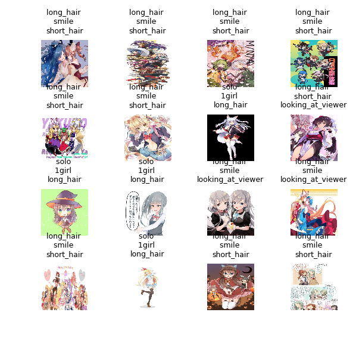

# anime-ranking-trends
Top Anime in 15 years: 2006-2021 Anime ranking.

## Tool (Python)
 - requests
 - matplotlib
 - StyleGAN2 w/ unet discriminator (for anime portrait generation)
## Video (YouTube)

[](https://www.youtube.com/watch?v=lfs43elDxY4 "Top Anime Ranking 2006-2021")

## Anime Tag Classification Examples


## Anime Data Exploration
 - Used crawler to download all image from URLs in dataset
 - Encoded tags and filtered common tags
 - Build utilities to display data / labels

## Anime Tag Classification
 - Used VGG16 to classify image by label
   - Multi-label classification
   - BCE loss
 - Fine-tuned hyperparameters
 - Testing Examples given

## Anime Tag Explorations

 - Designed "decay" ranking metrics
 - Previous Anime tags will have a "decay" factor, tag added at day ```i``` will have weight of ```e^(j-i)``` at day ```j```.
 - Built visualized graph showing anime tag popularity shifting
 - Interesting found: 
   - "Touhou", once popular at 2011-2014, is replaced by "Kantai collection" since 2014.
   - People have more variated preference over time.


